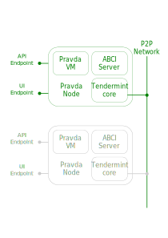

# How to run a single node testnet

The testnet is a simple small, but fully functional blockchain network for
experiments: you can run transactions (programs), introspect storage and watch
the node state via logs.



### 1. Build and install tools:

```
cd pravda
sbt universal:packageBin
sudo mkdir /usr/local/pravda

sudo unzip -d /usr/local/pravda node/target/universal/pravda-0.1.0.zip

# Add to .bashrc (or your favourite shell profile)
export PATH=/usr/local/pravda/pravda-0.1.0/bin:$PATH

# Now you should be able to run from everywhere
pravda
```

### 2. Start the node.

Use `start-bobo.sh` script to start the node. Change any option in the
script if you need to (if, for example, one of the used ports is busy).

After starting the script the node will:
	
1. Create a folder for tendermint and initialize a storage.
2. Run tendermint passing configuration to it.
3. Start ABCI server.
4. Tendermint will connect to the ABCI server and start interactions.
5. Tendermint will start http point to accept transactions on it.

### 3. Send some transaction (program) to node.

```
PRAVDA_PROGRAM=$(echo '2 2 add' | pravda compile forth | base64)
curl -X POST -H "Content-Type: application/base64" localhost:8081/api/private/broadcast?fee=0 -d $PRAVDA_PROGRAM
```

`echo '2 2 add' | pravda compile forth | base64` takes the program in command line, compiles it to
Pravda bytecode and prints it to standard out base64 encoded.

The program `2 2 add` pushes two integers on the stack and adds them. The
response to curl command must be `[00000004]`

